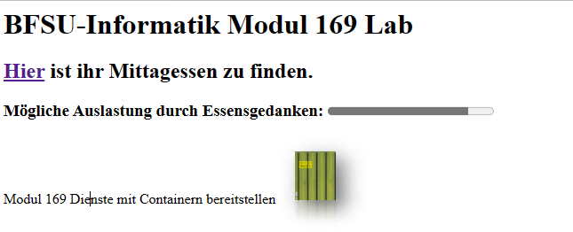

# Modul 169: webserver
Eine Webserver und Content soll in einem Container bereitgestellt werden
## Bestehendes Image verwenden und als Container ausführen
### Container erzeugen und ausführen
    docker run -d -p 8081:80 --name webserverBFSU dominikreussbzu/webserver:v1
### Prüfen, ob der Container als aktiv angezeigt wird
    docker ps
### Webseite im Container prüfen mit:
    docker exec -t webserverBFSU sh
    / # curl localhost:80
### Webseite ausserhalb des Containers aufrufen https://localhost:8081

    
## Container und Image wieder wegräumen
    docker stop webserverBFSU
    docker ps -a
    docker rm webserverBFSU
    docker images
    docker rmi weberserver:v1